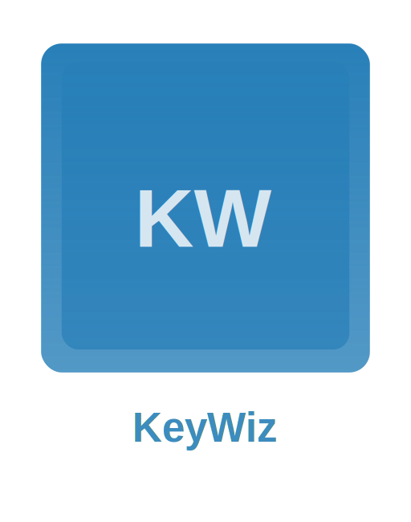

<div align="center">



# KeyWiz

#### Your Magical Keyboard Shortcut Assistant

[](https://opensource.org/licenses/MIT)
[](https://www.python.org/downloads/)
[](https://www.microsoft.com/windows)
[](http://makeapullrequest.com)

[Features](#-features) • [Installation](#-installation) • [Usage](#-usage) • [Contributing](#-contributing) • [Support](#-support)

---

</div>

<div align="center">
  
  <p><em>KeyWiz in action - showing Windsurf IDE shortcuts</em></p>
</div>


## 🎯 Overview

KeyWiz is your magical companion for mastering keyboard shortcuts in Windows. This sleek, always-on-top application dynamically displays shortcuts for your active application, helping you become a keyboard wizard! 

Perfect for:
- 💻 Developers seeking to boost productivity
- 🎨 Designers switching between creative tools
- 🚀 Power users optimizing their workflow
- 🎮 Anyone wanting to level up their keyboard skills

## ✨ Features

<table>
  <tr>
    <td width="50%">
      <h3>🔄 Dynamic Detection</h3>
      <ul>
        <li>Real-time shortcut updates</li>
        <li>Application-aware display</li>
        <li>Instant context switching</li>
      </ul>
    </td>
    <td width="50%">
      <h3>🎨 Modern Design</h3>
      <ul>
        <li>Sleek, frameless window</li>
        <li>Minimal visual footprint</li>
        <li>Customizable appearance</li>
      </ul>
    </td>
  </tr>
  <tr>
    <td width="50%">
      <h3>📌 Smart Positioning</h3>
      <ul>
        <li>Windows Snap support</li>
        <li>Left/right screen docking</li>
        <li>Always-on-top display</li>
      </ul>
    </td>
    <td width="50%">
      <h3>🛠 Extensible</h3>
      <ul>
        <li>Custom shortcut support</li>
        <li>Easy markdown format</li>
        <li>Growing shortcut database</li>
      </ul>
    </td>
  </tr>
</table>

## 🚀 Installation

### Prerequisites

- Windows 10/11
- Python 3.8+
- pip package manager

### Quick Start

```bash
# Clone the repository
git clone https://github.com/cloudwerxlab/keywiz.git
cd keywiz

# Install dependencies
pip install -r requirements.txt

# Launch KeyWiz
python keywhiz_app.py
```

### Building from Source

```bash
# Install PyInstaller
pip install pyinstaller

# Create executable
pyinstaller KeyWhiz.spec
```

## 📦 Dependencies

| Package | Purpose |
|---------|----------|
| PyQt5 | Modern GUI framework |
| psutil | Process management |
| pywin32 | Windows API integration |
| markdown2 | Shortcut file parsing |

## 💡 Usage

### Basic Controls

- **Toggle Position**: Click and drag to either screen edge
- **Show/Hide**: Double-click the title bar
- **Exit**: Right-click → Exit

### Adding Custom Shortcuts

1. Create a markdown file in `shortcuts/`
2. Name it after your application (e.g., `chrome.md`)
3. Format your shortcuts:

```markdown
# Chrome Shortcuts

## Navigation
- `Ctrl+T`: New tab
- `Ctrl+W`: Close tab
- `Alt+Left`: Back
```

## 🛠 Development

### Project Structure

```
keywiz/
├── 📜 keywhiz_app.py    # Main application
├── 📂 shortcuts/        # Shortcut definitions
├── 🎨 icons/           # Application assets
├── 📋 requirements.txt  # Dependencies
└── 📄 LICENSE          # MIT license
```

### Customization Options

```python
# In keywhiz_app.py
WINDOW_WIDTH = 300       # Adjust sidebar width
ACCENT_COLOR = "#4a9eff" # Change theme color
FONT_FAMILY = "Segoe UI" # Customize typography
```

## 🤝 Contributing

We love your input! Check out our [Contributing Guide](CONTRIBUTING.md) for ways to get started. Here's how you can help:

1. 🍴 Fork the repository
2. 🌿 Create a feature branch (`git checkout -b feature/AmazingFeature`)
3. 💾 Commit changes (`git commit -m 'Add AmazingFeature'`)
4. 📤 Push to branch (`git push origin feature/AmazingFeature`)
5. 📫 Open a Pull Request

## 📫 Support

- 🐛 [Report bugs](https://github.com/cloudwerxlab/keywiz/issues)
- 💡 [Request features](https://github.com/cloudwerxlab/keywiz/issues)
- 🤔 [Ask questions](https://github.com/cloudwerxlab/keywiz/discussions)
- 📧 Email: [cloudwerxlaboratories@gmail.com](mailto:cloudwerxlaboratories@gmail.com)
- 🌐 Website: [cloudwerxlab.com](https://cloudwerxlab.com)

## 📄 License

KeyWiz is MIT licensed, as found in the [LICENSE](./LICENSE) file.

---

<div align="center">

### Made with ❤️ by CLOUDWERX LAB

If KeyWiz helps your productivity, consider giving it a ⭐️!

</div>
